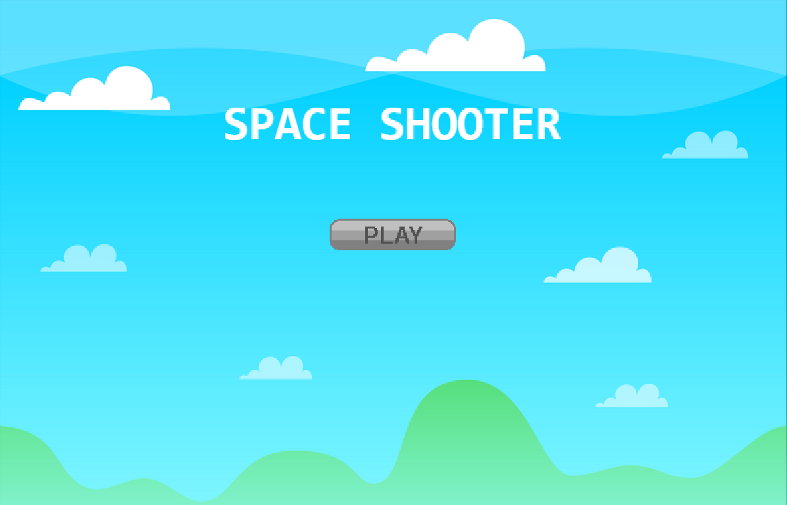
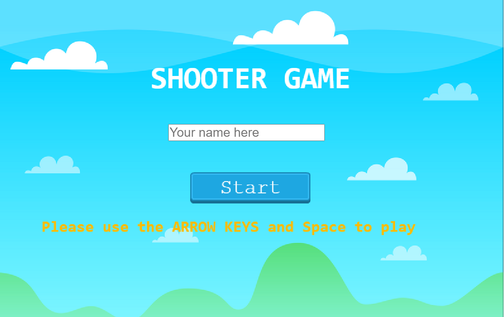
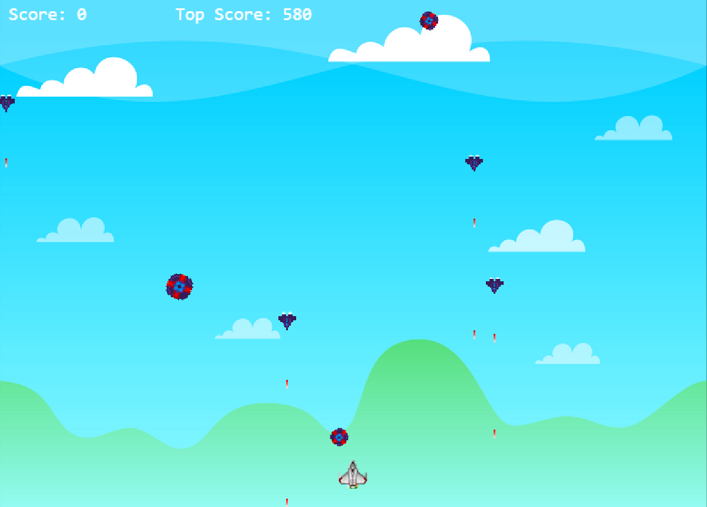
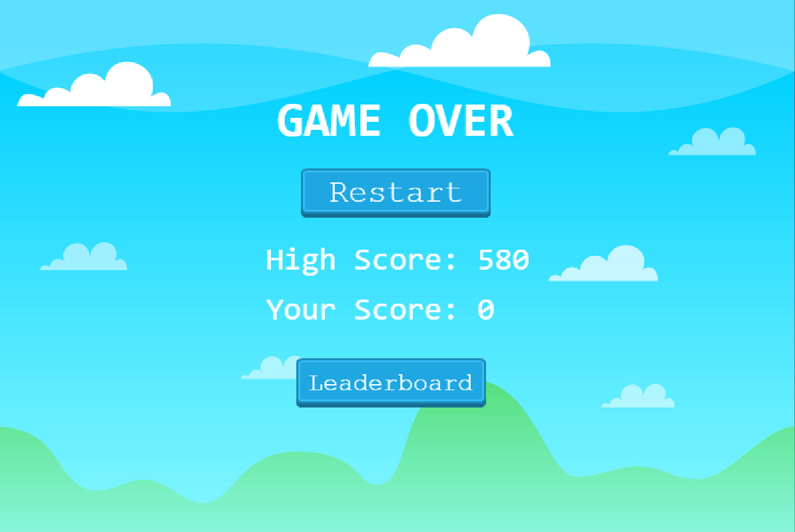
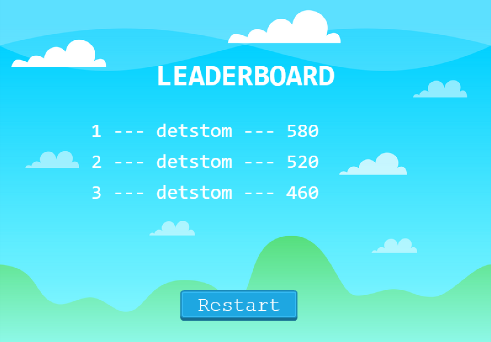

# Shooter Game

The goal of this project was to build a shooter game that can be played on the browser and stores your score on an online server

## Play the game
[Link](https://vigorous-wilson-ce4139.netlify.app/)

## Built with:

*   HTML 
*   Phaser3
*   Webpack
*   Javascript
*   Eslint
*   Babel
*   Jest
*   [Netlify](https://www.netlify.com/) for deployment
*   [Leaderboard API service](https://www.notion.so/Leaderboard-API-service-24c0c3c116974ac49488d4eb0267ade3) for high scores

## Getting Started

>Clone the repository
```
- git clone https://github.com/NiiazalyDzhumaliev/shooter-game.git;
- cd shooter/
```
>Install the dependencies
```
npm install
```
>Start the server
```
npm run start
```
>To run the unit tests
```
npm run test
```
## How to Play
+ MOVE UP: Press [UP] key
+ MOVE DOWN: Press [DOWN] key
+ MOVE LEFT: Press [LEFT] key
+ MOVE RIGHT: Press [RIGHT] key
+ SHOOT FIRE: Press [SPACEBAR] key

## About the game
A player is fighting against enemy ships. The player has a modern fighter plane and can shoot with fireballs that can destroy any ship. For each destroyed enemy the player will gain 20 points. The purpose of the game is to take as much points as possible to beat the highscore of other gamers. There are 3 types of enemies:

- Gunships - can shoot with with lasers;
- Carrierships - don't shoot, but can destroy enemy with itself;
- Chaserships - chase a player across the gameboard and destroy the plane.

## Instructions
A player can move the plane with ARROW KEYS and shoot with SPACE bar. The player's plane can explode by enemy's laser or by enemy ship itself. Avoid enemy ships and lasers and destroy them.

## Game screenshots






### Game Design & Development
- In order to get started with the game, I had to start by going through a tutorial on how to use Phaser [here](http://phaser.io/tutorials/making-your-first-phaser-3-game). This alongside the phaser documentation and examples provided the basic knowledge.

#### Assets
- I used assets from [OpenGameArt](https://opengameart.org/)

#### Development
- To develop the game I used Phaser Examples, tutorials and relative videos.

## Author

👤 **Niiazaly Zdhumaliev**

- Github: [@NiiazalyDzhumaliev](https://github.com/NiiazalyDzhumaliev)
- Twitter: [@Niiazaly1](https://twitter.com/Niiazaly1)
- Linkedin: [@niiazaly-dzhumaliev](https://www.linkedin.com/in/niiazaly-dzhumaliev-117707132/)

## 🤝 Contributing

Contributions, issues and feature requests are welcome!

Feel free to check the [issues page](https://github.com/NiiazalyDzhumaliev/shooter-game/issues)

## Future features
- More scenes and stages
- Power-ups
- Different player characters to choose from

## Show your support

Give a ⭐️ if you like this project!

## Acknowledgments

- All the resources used are open source and can be found on [gameart](https://gameart.org/)

## 📝 License

This project is free to use as learning purposes. For any external content (e.g. logo, images, ...), please contact the proper author and check their license of use.
